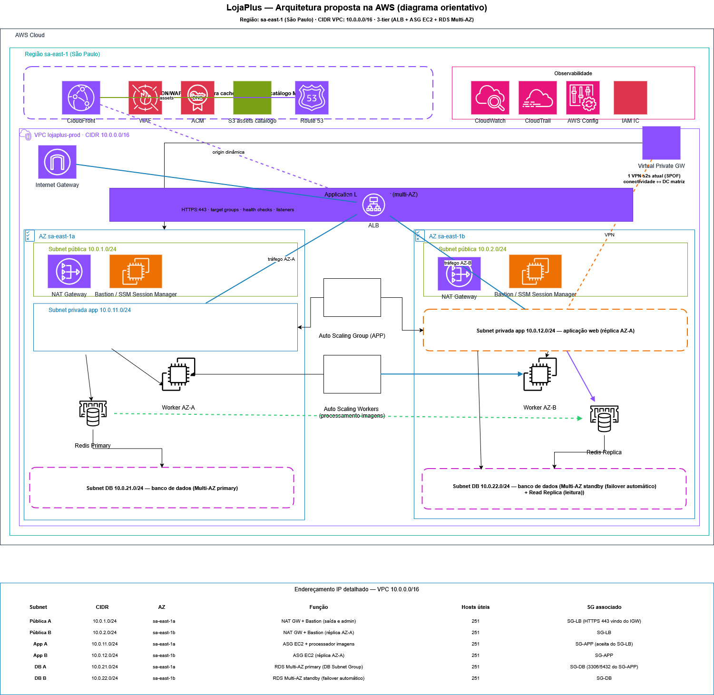

# LojaPlus — Infraestrutura (Terraform / AWS)

Este repositório contém a infraestrutura Terraform para o projeto LojaPlus. O objetivo é criar uma VPC altamente disponível (subnets por AZ, NAT por AZ), um Application Load Balancer, um Autoscaling Group para a aplicação, e um banco RDS PostgreSQL com opção de gerenciamento seguro de credenciais.

## Arquitetura

A arquitetura está em `arquitetura-final-aws.jpg` (diagrama orientativo). Ela descreve:

- VPC com CIDR 10.0.0.0/16
- 3 AZs com subnets públicas, subnets privadas para aplicação (app) e subnets privadas para banco (db)
- NAT Gateway por AZ (alta disponibilidade de saída)
- ALB (HTTP e opcionalmente HTTPS via ACM)
- ASG (EC2) para a aplicação
- RDS PostgreSQL Multi-AZ (primário + réplica)



## Pré-requisitos

- Terraform >= 1.3
- Credenciais AWS configuradas localmente (variáveis de ambiente ou perfil):
	- `AWS_ACCESS_KEY_ID` / `AWS_SECRET_ACCESS_KEY` ou profile no `~/.aws/credentials`
- Permissões IAM suficientes para criar/atualizar: VPC, Subnets, NAT Gateways, EC2, ALB, RDS, Secrets Manager, IAM (se necessário)

Recomendado para times: criar um backend remoto (S3 + DynamoDB) para o estado do Terraform antes de colaborar/rodar em produção.

## Passo a passo — uso básico

1) Inicializar o Terraform

```bash
terraform init
```

2) Validar a configuração

```bash
terraform validate
```

3) Planejar (exemplo sem senha — gera password automaticamente e salva no Secrets Manager)

```bash
terraform plan -out=tfplan
```

3b) Exemplo com senha fornecida (recomendado passar via variável sensível no CI):

```bash
terraform plan -var='db_password=SEU_VALOR_SEGURO' -out=tfplan
```

4) Aplicar

```bash
terraform apply "tfplan"
```

ou aplicar direto (será pedido confirmação):

```bash
terraform apply -var='db_password=SEU_VALOR_SEGURO'
```

Observação sobre a senha do RDS
- Se `var.db_password` ficar em branco (padrão), o Terraform gera uma senha forte via `random_password` e grava um Secret no AWS Secrets Manager. O ARN do Secret é exposto no output `db_password_secret_arn`.
- Alternativas seguras para passar a senha:
	- Exportar `TF_VAR_db_password` no ambiente (CI/CD) antes de rodar o Terraform.
	- Usar um arquivo `terraform.tfvars` localmente (NÃO commitar esse arquivo).

Exemplo (CI):

```bash
export TF_VAR_db_password="SEU_VALOR_SEG"
terraform plan
```

## Habilitar HTTPS no ALB

Para ativar HTTPS no ALB, informe o ARN de um certificado ACM via variável `acm_certificate_arn`.

Observações:
- Para usar CloudFront com certificado público, o certificado ACM deve estar em us-east-1 e a integração com CloudFront é recomendada para cache e WAF.
- Se quiser apenas forçar HTTPS no ALB, passe `acm_certificate_arn` e posso adicionar regra de redirecionamento HTTP→HTTPS (se não existir).

Exemplo de plan com ACM:

```bash
terraform plan -var='acm_certificate_arn=arn:aws:acm:REGION:ACCOUNT:certificate/ID'
```

## Outputs úteis

- `alb_dns` — DNS do ALB
- `rds` — endpoint do RDS (host)
- `vpc_id` — ID da VPC criada
- `public_subnets` — IDs das subnets públicas
- `private_app_subnets` — IDs das subnets privadas da aplicação
- `private_db_subnets` — IDs das subnets privadas do banco
- `nat_gateway_ids` — IDs dos NAT Gateways
- `db_password_secret_arn` — ARN do Secret no Secrets Manager (se a senha foi gerada)

Para ver os outputs após `apply`:

```bash
terraform output
terraform output alb_dns
```

## Recomendações de produção

- Usar backend remoto (S3) com DynamoDB para lock do estado.
- Habilitar `storage_encrypted = true` e KMS para RDS (se desejar controle sobre chaves).
- Configurar `backup_retention_days`, `maintenance_window` e `parameter_group` apropriados para RDS.
- Parametrizar AMIs e tipos de instância (não deixar AMI hardcoded em produção).
- Criar roles/instance profiles para EC2 com permissões mínimas (SSM para acesso sem SSH é preferível).
- Configurar CloudWatch Alarms, log groups, e CloudTrail para observabilidade.

## Recursos do diagrama ainda não implementados aqui (opcionais)

- CloudFront + WAF + Route53 (para CDN e proteção)
- ElastiCache (Redis) para caching
- Criação/manutenção de Hosted Zone no Route53
- Bastion EC2 (ou apenas SSM Session Manager) com IAM role apropriado

Se quiser, eu posso implementar qualquer um desses itens — diga qual prioridade e eu faço a alteração nos arquivos Terraform.
